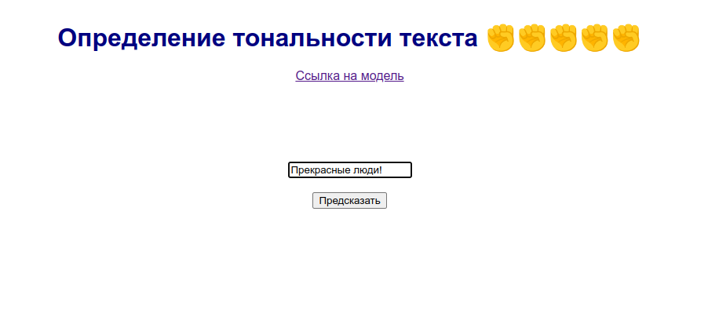

## Описание решения

 - Для классификации использовался [sismetanin/rubert-ru-sentiment](https://github.com/velupanov/bert_rus_sentiment)
 - Для вебсервиса использовался фрэймворк [Flask](https://flask.palletsprojects.com/en/3.0.x/)

## Запуск

### Без docker-а

```bash
python -m venv .venv
source .venv/bin/activate
pip install -r requirements.txt
python main.py
```

Далее выведется ссылка, по которой нужно перейти. Будет показана страница:



### С docker-ом

TODO
